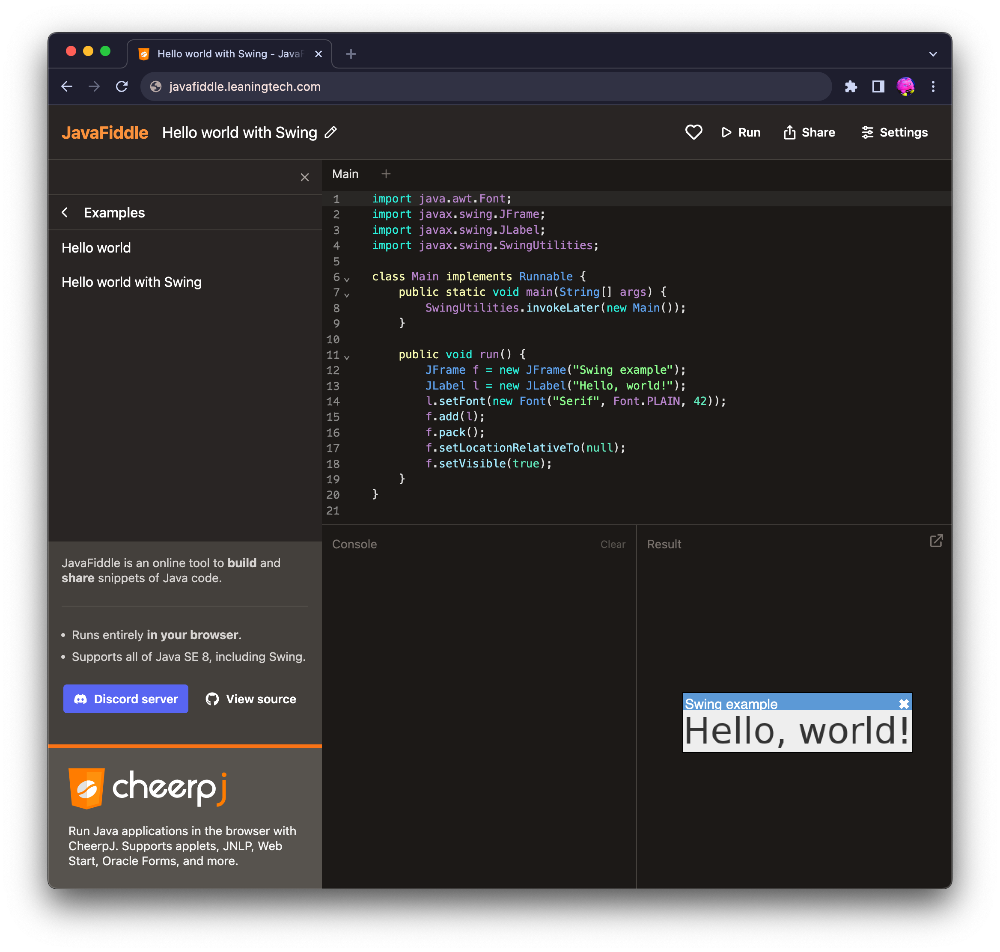

# JavaFiddle

[](https://discord.leaningtech.com)

JavaFiddle is an online tool to build and share snippets of Java code, powered by [CheerpJ](https://labs.leaningtech.com/cheerpj).

[](https://javafiddle.leaningtech.coml)

## Developing

```bash
pnpm install
pnpm run dev
```
